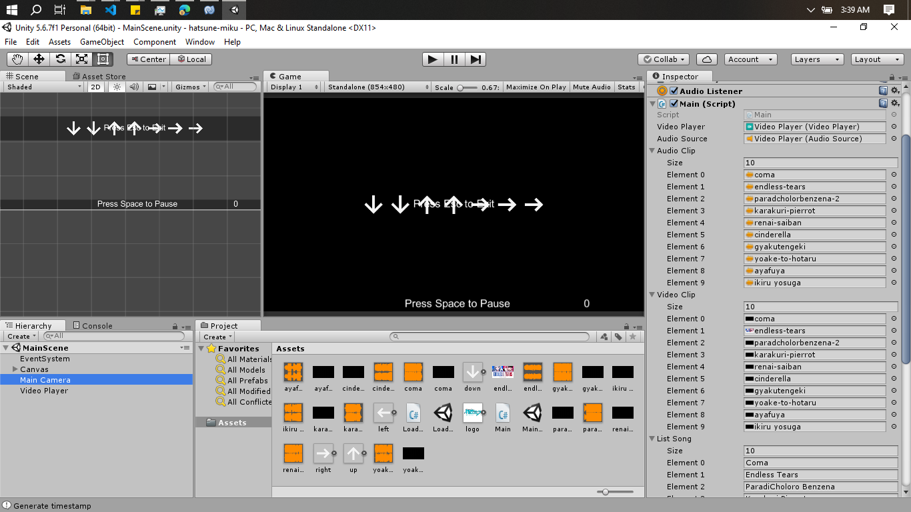
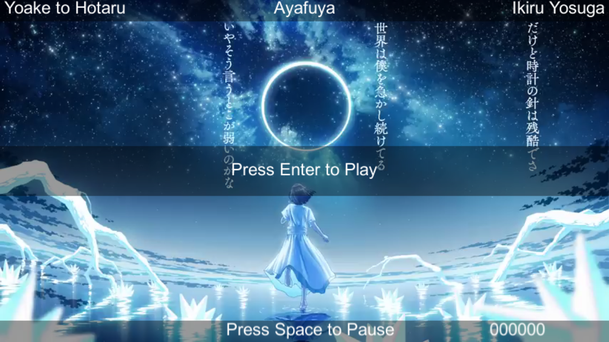

# Hatsune Miku

this project use [Unity 5.6.7f1](https://unity.com/releases/editor/archive);

video and audio in this game i get from youtube. 
for downloading video from youtube i use [yt-dlp](https://github.com/yt-dlp/yt-dlp?tab=readme-ov-file#installation) and to get mp3 from video i use [ffmpeg](https://ffmpeg.org/download.html).

the motivation of i created this game is to make alternative game like hatsune miku with my fav song,
and also to learn csharp. 


## Download

- [Full version](https://github.com/nursyah21/hatsune-miku/releases/tag/latest) (all songs)
- [Lite version](https://github.com/nursyah21/hatsune-miku/releases/tag/latest-lite) (only 3 songs)


## Screenshot


you just need to set video, audio, and title song and it will auto generate your game.



press left or right keyboard to change music. this layout inspired by cytus.


and thats it.

## Clone Repository

to clone this repository, you need to use git lfs 

because i use git lfs to store large files like mp3 or mp4

```bash
git lfs install
```

```bash
git clone https://github.com/nursyah21/hatsune-miku.git
cd hatsune-miku
git lfs pull
```

for better compability, i recommend you to use same version unity which is 5.6.7f1