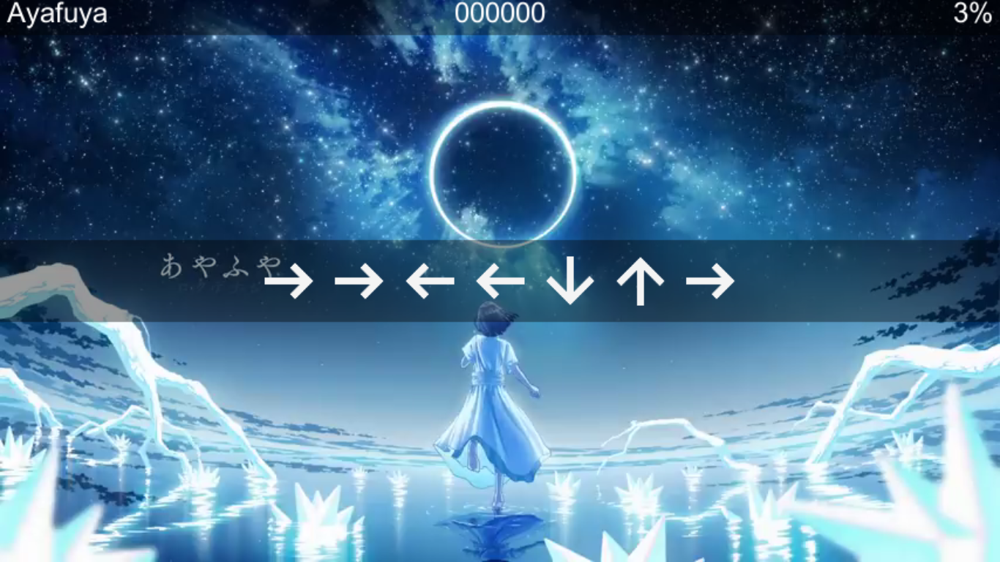

# Hatsune Miku

this project use [Unity 5.6.7f1](https://unity.com/releases/editor/archive);

video and audio in this game i get from youtube. 
for downloading video from youtube i use [yt-dlp](https://github.com/yt-dlp/yt-dlp?tab=readme-ov-file#installation) and to get mp3 from video i use [ffmpeg](https://ffmpeg.org/download.html).

the motivation of i created this game is to make alternative game like hatsune miku with my fav song,
and also to learn csharp. 

## Screenshot

you just need to set video, audio, and title song and it will auto generate your game.

press left or right keyboard to change music. this layout inspired by cytus.

and thats it.

## Download

you can run this game on windows with x86 or x86_64

i made it to have more compatible with any version windows.

- Full version (10 songs - 187mb)
- Lite version (3 songs - 68mb)